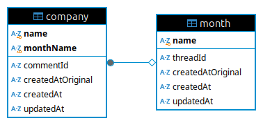

# HackerNews new jobs

A website that provides obvious, effortless and deep insights into fresh and recurring job opportunities in Hacker News "Who's Hiring" thread.

For example, if you are looking for a job and want to focus more on fresh opportunities or research the ad history of a specific company.

You are welcome to use, self-host, fork and modify, and contribute to this project.

## Demo

https://hackernews-new-jobs.arm1.nemanjamitic.com

## Screenshots

https://github.com/user-attachments/assets/c4acb705-e0ef-45bf-92a1-f445deabd660

## Features

- Separate companies by: 1. First time companies (first job ad ever), 2. New companies (no job ad in previous month), 3. Old companies (had job ad in previous month) for every month in history
- Display separated companies in multi-line chart graph
- Job ad posts are linked and sorted by original time of creation
- For every company in a month, find every job ad in history, link them and sort them chronologically
- Display separated companies by number of job ads in the previous 12 months period in bar chart graph
- Search job ads from a company
- Cron job for parsing a new month running between 2nd and 15th day every month
- Cron job to respect Algolia API rate limiting and parse and seed database for the entire history (since `2015-06` uniform formatting with `|` separated post titles)
- SQLite database for fast querying and Keyv caching for fast reads and page load
- Http response caching with Keyv to reduce load on Algolia API and mitigate rate limiting
- Docker deployments with x86 and ARM images, from local machine and Github Actions
- Next.js app router app with SSR and Shadcn components
- Responsive design and dark theme support
- Plausible analytics
- Winston logging
- Clean, separated types, constants, utils and config

## Installation and running

```bash
node -v
# v22.9.0

# set environment variables
cp .env.example .env

# install dependencies
yarn install

# run in dev mode, visit http://localhost:3000/
yarn dev

# build
yarn build

# run in prod mode
yarn standalone

# or
yarn cp
node .next/standalone/server.js

# Docker

# build image
yarn dc:build

# run
yarn dc:up
```

## Deployment

### Environment variables

Create `.env` file.

```bash
cp .env.example .env
```

Set environment variables.

```bash
# .env

# for metadata
SITE_HOSTNAME=my-domain.com

# protect endpoints
API_SECRET=long-string

# plausible analytics
PLAUSIBLE_SERVER_URL=https://plausible.my-domain.com
PLAUSIBLE_DOMAIN=my-domain.com
```

### Github Actions

Set the following Github secrets and use `build-push-docker.yml` and `deploy-docker.yml` Github Actions workflows to build, push and deploy Docker image to the remote server.

```bash
DOCKER_USERNAME
DOCKER_PASSWORD

REMOTE_HOST
REMOTE_USERNAME
REMOTE_KEY_ED25519
REMOTE_PORT
```

Copy seeded database to the remote server.

```bash
# replace <vars>
scp ./data/database/hn-new-jobs-database-dev.sqlite3 <user@server>:~/<your-path-on-server>/hn-new-jobs/data/database/hn-new-jobs-database-prod.sqlite3

# e.g.
scp ./data/database/hn-new-jobs-database-dev.sqlite3 arm1:~/traefik-proxy/apps/hn-new-jobs/data/database/hn-new-jobs-database-prod.sqlite3
```

### Deploy from local machine

```bash
# build and push x86 and arm images
yarn docker:build:push:all

# edit package.json script, replace <vars>
"deploy:docker:pi": "bash scripts/deploy-docker.sh <user@server> '~/<your-path-on-server>/hn-new-jobs' <your-image-name:latest>"

# deploy to remote server
yarn deploy:docker:pi
```

## Implementation details

### Data source

Initially app started with scraping original https://news.ycombinator.com thread pages and inside the [docs/old-code/scraper](docs/old-code/scraper) folder there is still complete scraper implementation. It uses Axios for fetching html but soon I discovered that their server has very strict rate limiting and such scrapper was getting a lot of unpredictable `ETIMEDOUT` and `ECONNRESET` connection abrupt terminations. It's easy to distinguish Axios from browser so I considered moving to Playwright until I discovered Algolia API https://hn.algolia.com/api.

As stated in docs it has generous rate limiting plan `10000 requests/hour` which is `2.77 requests/second`. Although in practice I experienced more strict rate limits than this, it is still more than enough to easily collect enough data. Especially the fact that you can receive up to 1000 items per a single request. Meaning pagination is almost not needed, although it is implemented. "Who is hiring" threads have up to 700 comments, entire thread can be fetched with a single API request.

Company names are extracted with a simple `|` character Regex from a comment title, this posting convention was enforced around the year 2015, so the database is seeded starting from `'2015-06'` month. You can see all of this in [constants/algolia.ts](constants/algolia.ts).

### Database

Threads are modeled with `Thread` and `Comment` models, although they are named `Month` and `Company` because those words make more sense in context of app logic. `Company` table is both `Company` and `Comment` (job ad) at same time, that is why for example self join is used to extract all ads for a company. `Month` primary key is `name` string in `'YYYY-MM'` format which is sortable.

Important implementation detail is that database connection is done as Singleton factory function and this way removed from the global scope. This allows the Next.js app to be built without requiring database connection at build time which significantly simplifies the build process. See this [Github discussion](https://github.com/vercel/next.js/discussions/35534#discussioncomment-11385544). The same Singleton factory is reused for both Keyv and Axios instances [utils/singleton.ts](utils/singleton.ts).

You can check schema in [modules/database/schema.ts](modules/database/schema.ts).

Database has just a single insert query, when a new month is parsed with scheduled cron job. Or by calling seeding job, which is mostly not needed because the seeded database for a range `2015-06` - `2024-11` is provided and committed in Git in [data/database/backup](data/database/backup) folder.

There is a number of select queries inside [modules/database/select](modules/database/select) to extract all wanted data, some of them are more complex. I decided not to use ORM this time and to stick to light weight solution with `better-sqlite3` library.

#### Database ER diagram



### Caching

Like stated in the previous section, database is dominantly read only which allowed for easy caching of query responses. This improved SSR pages loading performance from `1200 ms` to `400 ms`. There is just a single invalidation event, when new month is parsed, you can see it in [modules/parser/calls.ts](modules/parser/calls.ts).

Keyv library with KeyvFile is used for caching both http requests and database queries into `.json` files. Invalidating cache entry does not seem to remove it from the `.json` file to save space, this requires more research and it is added to [Todo](#todo) list.

Inside the [libs/keyv.ts](libs/keyv.ts) there is a `cacheDatabaseWrapper()` function that accepts database query function and returns cached version.

Keyv instances are also removed from the global scope with Singleton factory function.

### Scheduler

Scheduler is needed to execute parsing a new month, every day between 2nd and 15th day every month at 9:00am Belgrade time (`'0 9 2-15 * *'`). There is an additional logic to skip first two days if those are on weekend in [libs/datetime.ts](libs/datetime.ts).

Scheduler is also useful to seed the database for the entire history and avoid Algolia rate limits.

Initial idea was to add cron task inside the Docker image itself. After careful research I discovered that `crond` daemon must run as `root` user or it will produce `setpgid: Operation not permitted` error, see this [Github issue](https://github.com/gliderlabs/docker-alpine/issues/381#issuecomment-621946699). This was unacceptable because Next.js app needs to run as `non-root` user for security reasons and easier managing file permissions in Docker bind mount volumes (database, cache, log files).

This requires exposing scripts as API endpoints and running `crond` daemon in a separate Docker image, which is unpractical and greatly complicates deployment. There are 3rd party binaries to run scheduled tasks in Docker, mostly in Go [aptible/supercronic](https://github.com/aptible/supercronic).

Fortunately there are also few Node.js packages to run scheduled tasks, I picked [node-cron/node-cron](https://github.com/node-cron/node-cron) for simplicity and practical reasons.

Scheduled tasks definitions are in [modules/scheduler/main.ts](modules/scheduler/main.ts). Important note is that they are dynamically imported and invoked in [instrumentation.ts](instrumentation.ts) which will guarantee that they are scheduled exactly once and there are no double tasks. Here is [Next.js docs](https://nextjs.org/docs/app/building-your-application/optimizing/instrumentation) about this.

Scripts itself are also exposed (and left unused) as API endpoints in [app/api/parser/[script]/route.ts](app/api/parser/[script]/route.ts). They can also be executed manually as `tsx` scripts in dev mode in [modules/parser/main.ts](modules/parser/main.ts).

### Server side rendering

### Docker

### Plausible analytics

### Logging

## Todo

- Handle not found exceptions in database select queries
- Clear Keyv cache files, not just invalidate
- Winston rotate single file

## References

- Shadcn starter project (updated) https://github.com/shadcn-ui/next-template
- Shadcn components docs https://ui.shadcn.com/docs/components/accordion
- Shadcn chart examples https://ui.shadcn.com/charts
- Shadcn data table docs https://ui.shadcn.com/docs/components/data-table
- Search and pagination as url query params to keep SSR for filtering Products list https://nextjs.org/learn/dashboard-app/adding-search-and-pagination
- HN Algolia API docs https://hn.algolia.com/api
- Plausible configuration https://github.com/4lejandrito/next-plausible
- Remove database connection from global scope to remove database connection dependency at build time for a Next.js app https://github.com/vercel/next.js/discussions/35534#discussioncomment-11385544
- Alpine cron asn non-root user https://github.com/gliderlabs/docker-alpine/issues/381#issuecomment-621946699, https://stackoverflow.com/questions/63046301/how-to-run-cron-as-non-root-in-alpine
- Scheduler libraries overview for Node.js https://dev.to/ethanleetech/task-scheduling-in-nextjs-top-tools-and-best-practices-2024-3l77
- Instrumentation file, Next.js docs https://nextjs.org/docs/app/building-your-application/optimizing/instrumentation

## License

MIT license: [License](LICENSE)
